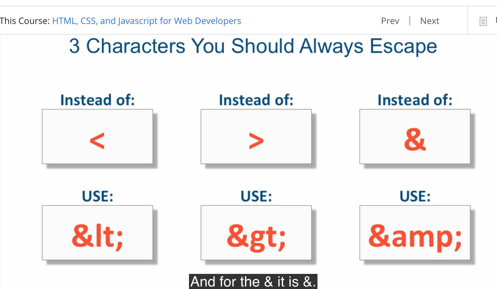

##课程笔记（ HTML, CSS, and Javascript for Web Developers）
####创建时间2019年4月23	
课程网址：https://www.coursera.org/learn/html-css-javascript-for-web-developers/lecture/efIYL/lecture-4-basic-html-document-structure 

#### 学习准备： GitHub，MacDown，sublime（或者其他编辑器），Git 
学习资料推荐：

### 1 HTML部分
1 <!doctype html> version declaration；
2 所有的内容会在body 部分显示 ; 
3 写好的HTML，可以复制到这个网站检查是否valid； （https://validator.w3.org/#validate_by_input ）。
4 HTML tags :https://www.w3schools.com/tags/ 
5 inline element and block-level element
6 Heading Elements (and some new HTML5 semantic comments)  SEO
h1 h2 h3 h4 ...
<header>
<section>
<aside>
<footer>
--
7 list


```
<ul>
<list> fruit</list>
    <ul>
    <list>apple</list>
    <list>orange</list>
    </ul>
<list>milk</list>
</ul>
```
8 entity reference
help avoid rendering issues
safeguard against more limited  character encoding
provide characters not available on a keyboard


example    
`&nbsp;` -none stop words    
 `&qout;`  

